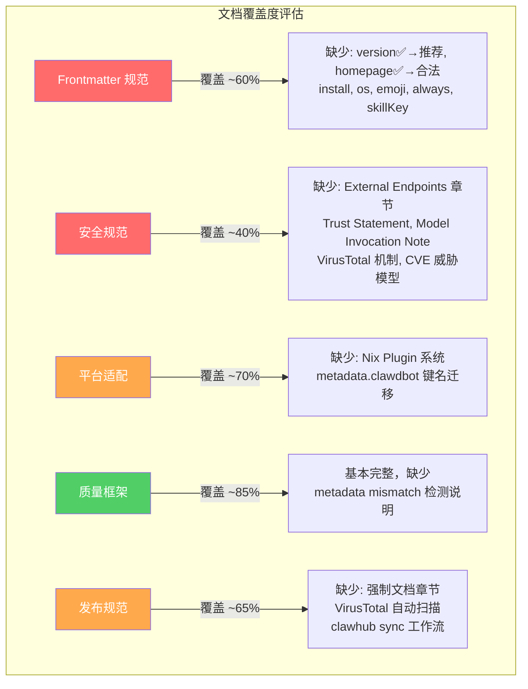

# OpenClaw Skill 生产规范 — 缺失分析报告

> 方法论：以 OpenClaw 2026 年 3 月最新官方规范为基准，逐项交叉比对 `openclaw-skill-production-spec.md` v0.1.0
> 分析日期：2026-04-01

---

## 总览：发现 13 处显著缺失

| 严重度 | 数量 | 说明 |
|--------|------|------|
| 🔴 CRITICAL | 6 | 会导致 Skill 发布失败或在新版本上不兼容 |
| 🟠 HIGH | 4 | 会导致功能缺失或用户体验严重降低 |
| 🟡 MEDIUM | 3 | 会限制 Skill 的适用范围或维护效率 |

---

## 🔴 CRITICAL — 会导致发布失败或不兼容

### GAP-01: `version` 字段被错误禁止

**文档现状（§4.3）：**
> "version — OpenClaw 解析器问题，放 CHANGELOG.md"

**最新官方规范：**
- ClawHub **要求** `version` 字段（SemVer 格式），用于注册表版本追踪
- `clawhub skill publish` 命令明确接受 `--version` 参数
- `clawhub sync --bump patch` 依赖 frontmatter 中的 version 字段做自动递增

**影响：** 文档指导开发者删除 version 字段，将导致：
1. ClawHub 发布流程受阻（缺少版本信息）
2. 用户无法追踪 Skill 更新
3. 自动化 CI/CD 工作流失效

> [!CAUTION]
> 这可能是文档编写时基于旧版 OpenClaw 的经验，但 2026 年 3 月的规范已明确支持并推荐 version 字段。

**建议修复：** 将 `version` 从"禁止字段"移至"推荐字段"，格式为 SemVer（如 `1.0.0`）。

---

### GAP-02: `homepage` 字段被错误禁止

**文档现状（§4.3）：**
> "homepage — 触发安全扫描"

**最新官方规范：**
- `homepage` 是 `metadata.openclaw` 下的合法可选字段
- 在 macOS Skills UI 中渲染为"Website"链接
- ClawHub 官方文档示例中包含 homepage 字段

**影响：** 禁止 homepage 导致：
1. 发布的 Skill 缺少官方文档链接
2. 用户无法从 UI 中直接跳转到文档页面
3. 降低了 Skill 的可发现性和可信度

**建议修复：** 将 `homepage` 从"禁止字段"移至"可选字段"，放在 `metadata.openclaw` 下而非 frontmatter 顶级。

---

### GAP-03: `metadata` 键名过时 — 应为 `metadata.clawdbot`

**文档现状（§4.4, §8.2）：**
> 使用 `metadata.openclaw` 作为标准键名

**最新官方规范：**
- ClawHub 注册表**正式解析** `metadata.clawdbot`
- `metadata.openclaw` 和 `metadata.clawdis` 作为别名被本地代理接受
- 但 ClawHub 安全分析和注册表功能以 `clawdbot` 为准

**影响：** 使用 `metadata.openclaw` 可能导致：
1. ClawHub 安全扫描无法正确匹配声明与实际行为
2. 注册表元数据解析不完整
3. 新版本中可能完全不兼容

**建议修复：** 全文替换 `metadata.openclaw` 为 `metadata.clawdbot`，并注明别名兼容性。

---

### GAP-04: 缺少强制性安全文档章节

**文档现状（§十一）：**
- 只有通用安全检查清单（命令注入、凭证、RCE 等）
- 没有提及 ClawHub 要求的**结构化安全文档**

**最新官方规范要求 SKILL.md 中必须包含以下章节才能通过审核：**

| 章节 | 文档是否覆盖 | 说明 |
|------|-------------|------|
| **External Endpoints** 表格 | ❌ 完全缺失 | 必须列出每个 URL、发送/接收的数据 |
| **Security & Privacy** 说明 | ⚠️ 仅有检查清单 | 需要描述凭证处理、数据处理、遥测 |
| **Model Invocation Note** | ❌ 完全缺失 | 需说明自主调用行为和 opt-out 选项 |
| **Trust Statement** | ❌ 完全缺失 | 必须包含："By using this skill, data is sent to [X]. Only install if you trust [X]." |

**影响：** 按当前文档生成的 Skill 将在 ClawHub 审核中被拒绝或标记（flag）。

**建议修复：** 在 §六 (SKILL.md 正文规范) 或 §十一 中新增"ClawHub 必需文档章节"子节，提供模板。

---

### GAP-05: 单行 JSON 规则可能过于绝对

**文档现状（§4.4）：**
> "OpenClaw 只支持单行 JSON。多行 YAML 静默解析失败。"

**最新官方规范：**
- 多个官方示例使用标准多行 YAML 格式（包括 `metadata.clawdbot` 下的嵌套对象）
- `install` 字段是**数组结构**，用单行 JSON 会极其难以阅读和维护
- 新增的 `nix` 配置也是深层嵌套结构

**影响：** 强制单行 JSON 导致：
1. `install` 字段几乎无法使用（installer 规格含 kind/formula/bins/os 等嵌套字段）
2. 复杂 metadata 配置变得不可维护
3. 可能基于旧版 bug 做出的判断，新版本已修复

> [!WARNING]
> 需要验证：在目标 OpenClaw 版本（2026.3.28+）上，多行 YAML metadata 是否仍然静默失败。如果已修复，则此规则应更新。

**建议修复：** 增加版本条件说明，标注此限制适用的具体 OpenClaw 版本范围。对新版本使用标准 YAML。

---

### GAP-06: 缺少 `install` 字段规范（自动依赖安装）

**文档现状：** 完全未提及

**最新官方规范：**
- `metadata.clawdbot.install` 是**关键功能字段**
- 支持 5 种 installer kind：`brew`, `node`, `go`, `uv`, `download`
- 每个 installer 包含 `kind`, `bins`, `formula/package`, `os` 等子字段
- OpenClaw 检测到缺失依赖时可自动触发安装

**影响：** 缺失此规范意味着：
1. 生产出的 Skill 无法利用自动依赖安装
2. 用户需要手动安装依赖（降低体验）
3. 跨平台 Skill 无法声明平台特定的安装方式

**建议修复：** 新增整节，覆盖 install 字段的完整规范和示例。

---

## 🟠 HIGH — 功能缺失或体验降低

### GAP-07: 缺少 `os` 字段（平台门控）

**文档现状：** 未提及

**最新官方规范：**
- `metadata.clawdbot.os` 接受 `["darwin", "linux", "win32"]`
- 加载时检查宿主 OS，不匹配则 Skill 不被加载
- 可在 Skill 级别和单个 installer 级别分别设置

**影响：** 跨平台 Skill 无法声明支持的操作系统，可能在不支持的平台上被错误触发。

---

### GAP-08: 缺少 `emoji` 字段

**文档现状：** 未提及

**最新官方规范：**
- `metadata.clawdbot.emoji` 在 macOS Skills UI 中用于显示 Skill 图标
- 增强用户识别度和 Skill 列表的可读性

**影响：** 次要，但影响 Skill 在 UI 中的辨识度。

---

### GAP-09: 缺少 Nix Plugin 系统说明

**文档现状：** 完全未提及

**最新官方规范：**
- OpenClaw 支持通过 Nix Flake 打包 Skill（`openclawPlugin` output）
- `metadata.clawdbot.nix` 包含 `plugin`, `systems`, `cliHelp` 等字段
- `config` 子字段包含 `requiredEnv`, `stateDirs`, `example`

**影响：** 面向 DevOps/基础设施领域的高级 Skill 无法利用 Nix 的确定性依赖管理。

---

### GAP-10: 缺少 VirusTotal 集成和自动化安全扫描说明

**文档现状（§10.2）：**
> "安全扫描 — VirusTotal + mcp-scan — 零 suspicious 标记"

仅在验证方法表中一行带过，完全未展开说明。

**最新官方规范：**
- 2026 年 2 月起 OpenClaw 与 VirusTotal 建立正式集成
- ClawHub 自动对发布的 Skill 包进行代码洞察扫描
- 扫描包括：嵌入的 secrets、shell 注入模式、未授权网络操作
- "benign" 判定可自动通过审核
- **Metadata Mismatch 检测**：如果代码中访问了未在 metadata 中声明的环境变量或二进制工具，会被 flag

**影响：** 开发者不了解自动化扫描机制，可能在发布时因 metadata mismatch 被意外拒绝。

**建议修复：** 在 §十一 或 §十二 中新增子节，详细说明 ClawHub 自动安全扫描的机制和常见 flag 原因。

---

## 🟡 MEDIUM — 限制适用范围或维护效率

### GAP-11: 缺少 `always` 字段说明

**最新规范：**
- `metadata.clawdbot.always: true` 使 Skill 跳过所有加载门控，始终活跃
- 对"基础设施型" Skill（如 linting、logging）非常有用

---

### GAP-12: 缺少 `skillKey` 字段说明

**最新规范：**
- `metadata.clawdbot.skillKey` 允许覆盖默认的调用键
- 在目录名与期望的命令名不一致时使用

---

### GAP-13: 缺少 CVE 安全威胁模型

**文档现状：** 安全规范（§十一）聚焦于 Skill 内部代码安全

**遗漏：** 未提及 OpenClaw 平台自身的安全漏洞对 Skill 的影响：
- CVE-2026-32922（CVSS 9.79）— 权限提升，可导致所有节点 RCE
- CVE-2026-25253 — gatewayUrl 验证缺陷，token 泄露
- CVE-2026-32061 — 路径穿越，可读取敏感文件
- CVE-2026-32049 — 超大 payload 导致 DoS

**影响：** Skill 开发者和用户不了解平台层面的风险，可能做出不安全的部署决策。

**建议修复：** 新增"平台安全态势"章节或附录，建议在容器化环境中运行、使用最小权限凭证等。

---

## 综合评估

---

## 建议的修复优先级

| 优先级 | GAP | 修复工作量 | 理由 |
|--------|-----|-----------|------|
| P0 立即 | GAP-01 (version) | 5 分钟 | 从禁止列表移除，改为推荐 |
| P0 立即 | GAP-02 (homepage) | 5 分钟 | 从禁止列表移除，说明正确放置位置 |
| P0 立即 | GAP-03 (clawdbot) | 15 分钟 | 全文替换键名 + 注明别名 |
| P0 立即 | GAP-04 (安全文档) | 30 分钟 | 新增模板，直接影响发布成功率 |
| P1 本周 | GAP-05 (JSON/YAML) | 15 分钟 | 验证实际行为后更新规则 |
| P1 本周 | GAP-06 (install) | 45 分钟 | 新增完整章节和示例 |
| P1 本周 | GAP-10 (VirusTotal) | 30 分钟 | 扩展安全章节 |
| P2 下周 | GAP-07~09, 11~13 | 各15分钟 | 补充缺失字段和上下文 |

---

## 值得肯定之处

尽管有上述缺失，文档在以下方面做得**非常优秀**，是罕见的高质量工作：

1. **致命失败模式分析（§九）** — 对 LLM 行为的深刻理解（F01-F06）在整个社区中几乎没有同等深度的文档
2. **渐进披露三层模型（§七）** — 对 Token 经济学的定量分析非常实用
3. **Description 写法（§五）** — 触发机制的逆向分析抓住了核心
4. **现实效能预期（§十四）** — 诚实地给出 50-60% 而非虚假承诺，这在技术文档中极为罕见
5. **自我审计（§十五）** — 自我检查精神

**总结：文档的核心洞察（LLM 行为学、Token 经济学、防御模式）是世界级水准的。主要缺失集中在对 OpenClaw 2026 年 Q1 新增平台能力的覆盖上 — 这属于时效性问题而非认知水平问题。**
